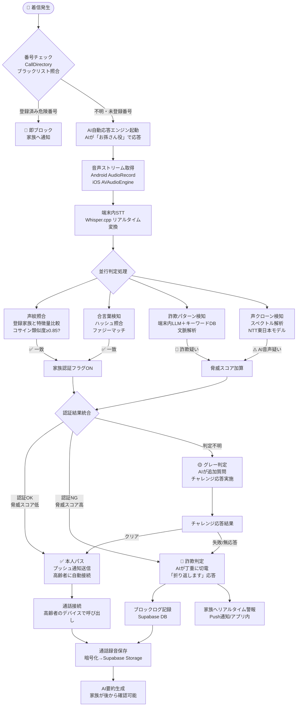
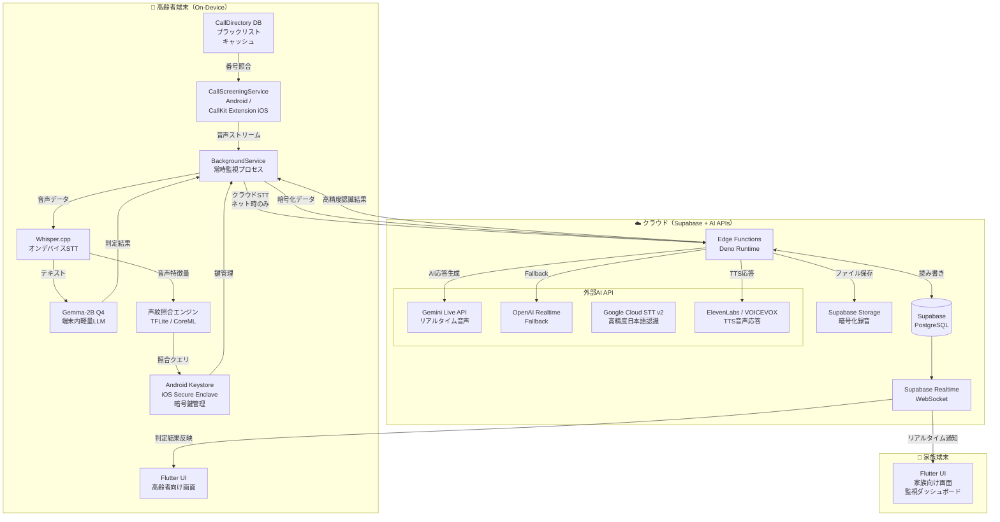
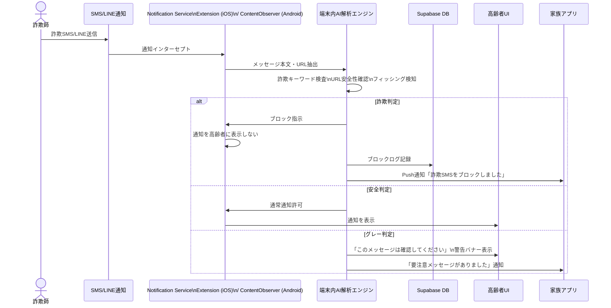
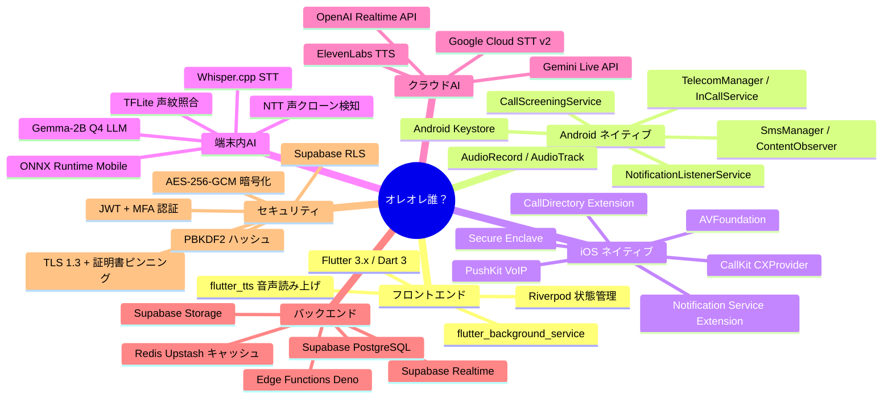

# 設計資料：「オレオレ誰？」（OreOre Dare?）
> **バージョン**: 1.0
> **作成日**: 2026年3月
> **対象**: 高齢者向け詐欺電話ガードアプリ
> **ステータス**: アーキテクチャ設計フェーズ

---

## 目次

1. [推奨技術スタック](#1-推奨技術スタック)
2. [システムアーキテクチャ図](#2-システムアーキテクチャ図)
3. [データベース設計](#3-データベース設計)
4. [API設計](#4-api設計)
5. [各画面のワイヤーフレーム詳細記述](#5-各画面のワイヤーフレーム詳細記述)
6. [潜在的な技術的課題と解決策](#6-潜在的な技術的課題と解決策)

---

## 1. 推奨技術スタック

### 1.1 フロントエンド（クロスプラットフォーム）

| 技術 | 選定理由 |
|------|----------|
| **Flutter 3.x** | iOS/Android 1コードベース対応。高齢者向けの大きなフォント・カスタムウィジェット実装が容易。ネイティブコードとのFFI連携（通話制御・音声処理）も実績が豊富 |
| **Dart 3.x** | Null安全性が高く、バックグラウンドサービスの安定稼働に優れる |
| **flutter_tts** | 音声読み上げ（TTS）ライブラリ。高齢者向けUIの音声ガイド実装 |
| **flutter_accessibility_service** | アクセシビリティ対応（文字サイズ・コントラスト連動）|

**Flutter採用の追加理由:**
- `flutter_background_service` でバックグラウンド常時監視サービスを統一実装可能
- `platform_channels` を通じてAndroid Telephony / iOS CallKit のネイティブAPIを呼び出せる
- Riverpod / flutter_bloc による状態管理で、AI判定結果のリアルタイムUI反映が実現しやすい

---

### 1.2 通話・メッセージ制御

#### Android

| 技術 | 役割 |
|------|------|
| **Android Telecom API (TelecomManager / InCallService)** | 着信を横取りしてAIを間に挟む。`InCallService` 継承により通話セッションを管理 |
| **TelecomManager.addNewIncomingCall()** | カスタム通話フローの開始点 |
| **CallScreeningService** | Android 9以上対応。着信番号を受け取り「スクリーニング判定」を返す（許可・拒否・無音対応） |
| **AudioRecord + AudioTrack** | 通話中の音声ストリームをリアルタイム取得・再生 |
| **SmsManager / ContentObserver** | SMS受信の監視と本文テキスト取得 |
| **NotificationListenerService** | LINE等の通知文を取得（アクセシビリティ経由） |

**Android 14以降の注意点:**
- `READ_CALL_LOG` 権限はユーザーが明示的に許可が必要。初回起動フローで丁寧に説明する
- `RECORD_AUDIO` は通話中のみ有効化し、終了後即時停止する設計でプライバシー配慮

#### iOS

| 技術 | 役割 |
|------|------|
| **CallKit (CXProvider / CXCallController)** | 通話UIのカスタマイズ。着信表示・保留・応答を制御 |
| **CallDirectory Extension** | 迷惑電話番号データベースとの照合（オフライン対応）|
| **AVFoundation** | 音声録音・再生・リアルタイム音声処理 |
| **PushKit (VoIP Push)** | 着信時のバックグラウンド即時起動（iOSで確実な着信検知に必須）|
| **Messages Framework** | SMS/MMSの内容解析（Extensionとして実装）|
| **Notification Service Extension** | プッシュ通知のインターセプト・内容変換 |

**iOS制限への対応:**
- iOSはAndroidと違い通話音声への直接アクセスが不可。**回避策**: CallKit + ネットワーク経由中継（後述のメディアサーバー）によりAI処理を実現
- LINE等のサードパーティメッセージングは `NotificationServiceExtension` で通知文のみ取得可能

---

### 1.3 AI音声応答・リアルタイム解析

#### 処理の分担方針（端末内 vs クラウド）

```
【端末内処理（オフライン優先）】
  - 軽量詐欺パターン検知（キーワードマッチ + 小型LLM）
  - 事前登録声紋との照合（特徴量ベクトル比較）
  - 声クローン基礎検知（スペクトル解析）
  - CallDirectory の番号ブラックリスト照合

【クラウド処理（通信時のみ）】
  - 高精度音声認識（STT: Speech-to-Text）
  - 高精度声クローン・生成AI音声検知
  - 通話AI応答の音声生成（TTS応答）
  - 詐欺パターンの継続学習・モデル更新配信
```

#### 端末内AIモデル

| 技術 | 役割 |
|------|------|
| **whisper.cpp (量子化モデル)** | 端末内STT。Whisper Tiny / Baseモデルをint8量子化で動作。約80MBでリアルタイム近似書き起こし |
| **TensorFlow Lite / Core ML** | 声クローン検知モデル・詐欺パターン分類器の推論エンジン |
| **llama.cpp (Gemma-2B Q4量子化)** | 端末内軽量LLMによる文脈判断。応答文生成も兼用 |
| **ONNX Runtime Mobile** | モデルのクロスプラットフォーム推論（Flutter統合しやすい）|

#### クラウドAI（ネット接続時）

| 技術 | 役割 | 採用理由 |
|------|------|----------|
| **Gemini Live API (Google)** | リアルタイム音声応答・会話AI | 2026年時点で最も低遅延。マルチモーダル対応 |
| **OpenAI Realtime API (fallback)** | 音声↔音声リアルタイム応答のバックアップ | GPT-4o audio対応、安定性実績 |
| **Google Cloud Speech-to-Text v2** | 高精度STT（日本語特化モデル）| 高齢者の話し方・訛り対応 |
| **ElevenLabs / VOICEVOX** | 高齢者に安心感を与える応答音声TTS | 自然な日本語音声生成 |

#### 声クローン・生成AI音声対策（2026年時点の最新アプローチ）

| 手法 | 説明 |
|------|------|
| **スペクトル一貫性検査** | 人間の声は発話間で基音周波数・フォルマント遷移に物理的連続性がある。クローン音声はこの遷移が不自然 |
| **呼吸・環境音検査** | 実際の通話には呼吸音・環境音・マイクノイズが含まれる。クローン合成音は無音区間が不自然にクリーン |
| **随機チャレンジ応答** | 「今日の日付を逆から言ってください」等のランダムチャレンジをAIが自動生成。声クローンは想定外テキストへの即応が困難 |
| **NTT東日本 ディープフェイク音声検知モデル** | 2025年公開の推論モデルをTFLite変換して端末内組み込み |
| **音声メタデータ解析** | VoIP通話の場合、パケットロス・ジッター特性が合成音声と実音声で異なる |

---

### 1.4 バックエンド・データベース

| 技術 | 選定理由 |
|------|----------|
| **Supabase** | PostgreSQL + リアルタイム購読 + Auth + Storage を一括提供。BaaS として最もコスパが高く、スタートアップ段階から自社サーバーへの移行も容易 |
| **Supabase Realtime** | 家族側ダッシュボードへの着信通知・判定結果をWebSocket でプッシュ配信 |
| **Supabase Storage** | 通話録音ファイル（暗号化済み）の安全な保管 |
| **Supabase Edge Functions (Deno)** | サーバーレス処理。AI API連携・声紋照合・外部DB照会を実装 |
| **Redis (Upstash)** | セッション管理・リアルタイム判定結果のキャッシュ・レートリミット制御 |

**将来のスケール対応:**
- Supabase → GCP Cloud Run + Cloud SQL への移行パスを最初から設計に組み込む
- 音声ファイルは Supabase Storage → GCS への変更を想定した抽象化レイヤーを設ける

---

### 1.5 声紋・合言葉登録機能の実装方法

#### 声紋登録フロー

```
1. 家族が「声紋登録モード」を起動
2. 指定テキスト（5〜10文）を音読（サンプル収集）
3. 端末内で音声特徴量を抽出
   - MFCCs（メル周波数ケプストラム係数）
   - x-vector / d-vector（深層話者埋め込みベクトル）
   ※ SpeechBrain / resemblyzer ライブラリのTFLite変換版を利用
4. 特徴量ベクトルをAES-256暗号化してSupabase に保存
   ※ 生音声データは端末ローカルのみに保持し、クラウドには特徴量のみ送信
5. 照合時：コサイン類似度 ≥ 0.85 で本人確認成立
```

#### 合言葉登録フロー

```
1. 家族がアプリ内で合言葉テキストを設定（例：「今日はいい天気だね」）
2. PBKDF2-HMAC-SHA256 でハッシュ化して保存（平文は保持しない）
3. 通話中に相手が合言葉を発話 → STTでテキスト変換 → ハッシュ照合
4. 部分一致・音韻的類似性も考慮（「今日はいい天気」≒「きょうはいいお天気」）
   - Levenshtein距離 + 音素変換でファジーマッチ
5. 合言葉照合成功時 → 本人確認フラグを立てて通話を高齢者にパス
```

---

### 1.6 プライバシー・セキュリティ対策

#### 日本個人情報保護法（改正2022年）・GDPR 対応

| 要件 | 実装方法 |
|------|----------|
| **利用目的の明示** | 初回起動時に利用規約＋プライバシーポリシーを大きな文字で表示。同意なし利用不可 |
| **データ最小化原則** | 通話音声はSTT変換後即時削除。特徴量のみ保持 |
| **保存期間制限** | 通話録音：30日自動削除（設定可変）。判定ログ：180日後匿名化 |
| **第三者提供制限** | AI処理用クラウドAPIは「委託先」として利用規約に明記。データ販売・広告利用を禁止 |
| **開示・削除請求対応** | アプリ内「データ削除申請」ボタン → 72時間以内に全データ削除 |
| **越境移転対応** | 日本ユーザーデータは国内リージョン（Supabase Tokyo）に保管。海外API連携時はデータ処理契約（DPA）を締結 |

#### 技術的セキュリティ

| 項目 | 実装 |
|------|------|
| **通信暗号化** | TLS 1.3 強制。証明書ピンニング実装 |
| **音声データ暗号化** | AES-256-GCM + 端末固有鍵（Android Keystore / iOS Secure Enclave） |
| **声紋特徴量** | クラウド保存時はユーザーIDと分離（仮名化）。結合キーは別テーブルで管理 |
| **認証** | Supabase Auth（JWT + Refresh Token）。家族アカウントにMFA必須 |
| **不正アクセス検知** | Supabase RLS（行レベルセキュリティ）で全テーブルのアクセス制御 |
| **アプリ改ざん検知** | Android: SafetyNet Attestation / iOS: DeviceCheck |

---

## 2. システムアーキテクチャ図

### 2.1 全体フロー（着信 → AI応答 → 判定 → パス/ブロック）



---

### 2.2 コンポーネント間の関係図



---

### 2.3 SMS/メッセージ解析フロー



---

## 3. データベース設計

### 3.1 ER図

```mermaid
erDiagram
    USERS {
        uuid id PK
        string phone_number UK
        string display_name
        enum role "elderly / family"
        timestamp created_at
        timestamp updated_at
        boolean is_active
        string device_token "Push通知トークン"
        string app_version
    }

    ELDERLY_PROFILES {
        uuid id PK
        uuid user_id FK
        string nickname "AIが呼ぶ名前"
        string locale "方言・地域設定"
        int font_size_preference
        boolean voice_guide_enabled
        boolean auto_answer_enabled
        int sensitivity_level "1-5: 詐欺検知感度"
        boolean offline_mode_preferred
        timestamp last_active_at
    }

    FAMILY_RELATIONSHIPS {
        uuid id PK
        uuid elderly_user_id FK
        uuid family_user_id FK
        string relationship_label "息子, 娘, 孫など"
        boolean is_emergency_contact
        boolean can_manage_settings
        boolean can_view_history
        timestamp registered_at
        timestamp approved_at "高齢者が承認した日時"
    }

    VOICE_PRINTS {
        uuid id PK
        uuid user_id FK "登録した家族のuser_id"
        uuid elderly_user_id FK "保護対象の高齢者"
        bytea feature_vector "AES-256暗号化済み特徴量ベクトル"
        string model_version "使用したモデルのバージョン"
        float quality_score "登録サンプルの品質スコア"
        int sample_count "録音サンプル数"
        boolean is_active
        timestamp registered_at
        timestamp expires_at "6ヶ月で再登録推奨"
    }

    SECRET_WORDS {
        uuid id PK
        uuid elderly_user_id FK
        uuid family_user_id FK "設定した家族"
        string word_hash "PBKDF2-HMAC-SHA256"
        string salt
        string hint_label "例：夏の思い出フレーズ"
        boolean is_active
        int use_count
        timestamp created_at
        timestamp last_used_at
    }

    INCOMING_CALLS {
        uuid id PK
        uuid elderly_user_id FK
        string caller_number "匿名化処理済み"
        string caller_name_hint "電話帳の表示名"
        timestamp received_at
        int duration_seconds
        enum ai_verdict "safe / suspicious / blocked / passed"
        float threat_score "0.0-1.0"
        boolean voice_clone_detected
        boolean secret_word_matched
        float voice_print_score
        string ai_response_text "AIが応答した内容"
        string stt_transcript_encrypted "暗号化書き起こし"
        uuid recording_file_id FK
        boolean family_notified
        timestamp deleted_at "30日後に自動削除"
    }

    RECORDING_FILES {
        uuid id PK
        uuid call_id FK
        string storage_path "Supabase Storage パス"
        string encryption_key_id "Keystoreキー識別子"
        int file_size_bytes
        string ai_summary_encrypted "AI要約 暗号化"
        boolean family_accessible
        timestamp created_at
        timestamp expires_at "30日後削除"
    }

    SMS_ANALYSIS_LOGS {
        uuid id PK
        uuid elderly_user_id FK
        string sender_number_hash "匿名化"
        enum source "sms / line / other"
        enum verdict "safe / suspicious / blocked"
        float threat_score
        string detected_patterns "検知したパターン JSON"
        boolean url_detected
        boolean link_blocked
        boolean family_notified
        timestamp received_at
        timestamp deleted_at
    }

    BLOCK_LIST {
        uuid id PK
        uuid elderly_user_id FK
        string phone_number_hash "匿名化"
        enum source "user_manual / ai_detection / national_db / family_set"
        string reason
        boolean is_active
        int block_count "ブロック累計回数"
        timestamp created_at
        timestamp expires_at "期限付きブロック対応"
    }

    SAFE_LIST {
        uuid id PK
        uuid elderly_user_id FK
        string phone_number_hash
        string contact_name
        enum source "family_registered / user_manual"
        boolean bypass_ai_check "AI確認をスキップ"
        timestamp created_at
    }

    ALERT_NOTIFICATIONS {
        uuid id PK
        uuid elderly_user_id FK
        uuid family_user_id FK "通知先家族"
        enum alert_type "call_blocked / sms_blocked / suspicious_call / voice_clone_detected"
        string message_body
        boolean is_read
        string reference_id "関連するcall_id or sms_id"
        timestamp sent_at
        timestamp read_at
    }

    SUBSCRIPTION_PLANS {
        uuid id PK
        uuid user_id FK
        enum plan "free / premium"
        timestamp started_at
        timestamp expires_at
        string payment_provider
        boolean is_active
    }

    USERS ||--o| ELDERLY_PROFILES : "has"
    USERS ||--o{ FAMILY_RELATIONSHIPS : "elderly_user"
    USERS ||--o{ FAMILY_RELATIONSHIPS : "family_user"
    USERS ||--o{ VOICE_PRINTS : "registers"
    USERS ||--o{ SECRET_WORDS : "elderly_user"
    USERS ||--o{ SECRET_WORDS : "family_user"
    USERS ||--o{ INCOMING_CALLS : "elderly_user"
    USERS ||--o{ SMS_ANALYSIS_LOGS : "elderly_user"
    USERS ||--o{ BLOCK_LIST : "has"
    USERS ||--o{ SAFE_LIST : "has"
    USERS ||--o| SUBSCRIPTION_PLANS : "subscribes"
    INCOMING_CALLS ||--o| RECORDING_FILES : "has"
    INCOMING_CALLS ||--o{ ALERT_NOTIFICATIONS : "triggers"
    SMS_ANALYSIS_LOGS ||--o{ ALERT_NOTIFICATIONS : "triggers"
```



---

### 3.2 主要テーブルの補足説明

#### INCOMING_CALLS テーブルの設計意図

- `threat_score`（0.0〜1.0）：複数の判定スコアを加重平均した総合脅威スコア
  - 0.0〜0.3：安全（パス）
  - 0.3〜0.6：グレー（追加確認）
  - 0.6〜1.0：危険（ブロック）
- `stt_transcript_encrypted`：書き起こしテキストは暗号化保存。AI処理後は音声本体より長期保持可能（30日以上）
- `deleted_at`：論理削除対応。定期バッチで物理削除

#### プライバシー設計の工夫

- 電話番号は **SHA-256 + Salt でハッシュ化**してDBに保存（平文は保持しない）
- 声紋特徴量は **user_id とは別テーブル** に保存し、UUIDのみで紐付け（仮名化）
- 録音ファイルは **端末の暗号鍵（Keystore/Secure Enclave）** で暗号化後にStorageへ

---

## 4. API設計

```yaml
openapi: 3.1.0
info:
  title: オレオレ誰？ API
  version: 1.0.0
  description: |
    高齢者向け詐欺電話ガードアプリ「オレオレ誰？」のバックエンドAPI。
    認証にはSupabase JWTトークンを使用。
    全通信はTLS 1.3必須。
  contact:
    name: OreOreDare API Support

servers:
  - url: https://api.oreore-dare.jp/v1
    description: 本番環境
  - url: https://api-staging.oreore-dare.jp/v1
    description: ステージング環境

security:
  - bearerAuth: []

components:
  securitySchemes:
    bearerAuth:
      type: http
      scheme: bearer
      bearerFormat: JWT

  schemas:
    Error:
      type: object
      properties:
        code:
          type: string
        message:
          type: string
        details:
          type: object

    FamilyMember:
      type: object
      properties:
        id:
          type: string
          format: uuid
        display_name:
          type: string
        relationship_label:
          type: string
          example: "息子"
        phone_number:
          type: string
          description: "マスク済み（下4桁のみ表示）"
        is_emergency_contact:
          type: boolean
        voice_print_registered:
          type: boolean
        secret_word_registered:
          type: boolean
        registered_at:
          type: string
          format: date-time

    CallRecord:
      type: object
      properties:
        id:
          type: string
          format: uuid
        caller_number_masked:
          type: string
          example: "090-****-1234"
        received_at:
          type: string
          format: date-time
        duration_seconds:
          type: integer
        ai_verdict:
          type: string
          enum: [safe, suspicious, blocked, passed]
        threat_score:
          type: number
          format: float
          minimum: 0
          maximum: 1
        voice_clone_detected:
          type: boolean
        secret_word_matched:
          type: boolean
        ai_response_text:
          type: string
        has_recording:
          type: boolean
        ai_summary:
          type: string
          description: "録音のAI要約（プレミアム機能）"

    AlertNotification:
      type: object
      properties:
        id:
          type: string
          format: uuid
        alert_type:
          type: string
          enum: [call_blocked, sms_blocked, suspicious_call, voice_clone_detected]
        message:
          type: string
        is_read:
          type: boolean
        sent_at:
          type: string
          format: date-time
        reference_id:
          type: string

    ElderlySettings:
      type: object
      properties:
        auto_answer_enabled:
          type: boolean
        sensitivity_level:
          type: integer
          minimum: 1
          maximum: 5
        font_size_preference:
          type: integer
          minimum: 14
          maximum: 28
        voice_guide_enabled:
          type: boolean
        ai_voice_character:
          type: string
          enum: [grandson, granddaughter, neutral]
          description: "AIが名乗るキャラクター"
        nickname:
          type: string
          description: "AIが呼ぶ高齢者の名前"

paths:

  # =====================
  # 認証
  # =====================
  /auth/register:
    post:
      summary: 新規ユーザー登録
      tags: [認証]
      security: []
      requestBody:
        required: true
        content:
          application/json:
            schema:
              type: object
              required: [phone_number, role, display_name]
              properties:
                phone_number:
                  type: string
                  example: "09012345678"
                role:
                  type: string
                  enum: [elderly, family]
                display_name:
                  type: string
                  example: "田中花子"
                invite_code:
                  type: string
                  description: "家族招待コード（familyロールの場合に使用）"
      responses:
        201:
          description: 登録成功
          content:
            application/json:
              schema:
                type: object
                properties:
                  user_id:
                    type: string
                    format: uuid
                  access_token:
                    type: string
                  refresh_token:
                    type: string
        400:
          description: バリデーションエラー
          content:
            application/json:
              schema:
                $ref: '#/components/schemas/Error'

  /auth/refresh:
    post:
      summary: トークンリフレッシュ
      tags: [認証]
      security: []
      requestBody:
        required: true
        content:
          application/json:
            schema:
              type: object
              required: [refresh_token]
              properties:
                refresh_token:
                  type: string
      responses:
        200:
          description: 新しいトークン
          content:
            application/json:
              schema:
                type: object
                properties:
                  access_token:
                    type: string
                  expires_in:
                    type: integer

  # =====================
  # 家族管理API
  # =====================
  /family/invite:
    post:
      summary: 家族招待コード生成
      description: 高齢者が家族を招待するための一時コードを生成
      tags: [家族管理]
      responses:
        201:
          content:
            application/json:
              schema:
                type: object
                properties:
                  invite_code:
                    type: string
                    example: "HANA-2847"
                  expires_at:
                    type: string
                    format: date-time
                    description: "24時間有効"
                  qr_code_url:
                    type: string
                    description: "QRコード画像URL"

  /family/members:
    get:
      summary: 登録済み家族一覧取得
      description: 高齢者または家族がアクセス可能
      tags: [家族管理]
      responses:
        200:
          content:
            application/json:
              schema:
                type: object
                properties:
                  members:
                    type: array
                    items:
                      $ref: '#/components/schemas/FamilyMember'

  /family/members/{family_user_id}:
    delete:
      summary: 家族登録の解除
      tags: [家族管理]
      parameters:
        - name: family_user_id
          in: path
          required: true
          schema:
            type: string
            format: uuid
      responses:
        204:
          description: 削除成功

  # =====================
  # 声紋・合言葉登録API
  # =====================
  /voice-print/register:
    post:
      summary: 声紋特徴量の登録・更新
      description: |
        家族が自分の声紋特徴量を登録。
        音声ファイルはクライアント側で特徴量に変換してから送信。
        生音声データは送信しない。
      tags: [声紋・合言葉]
      requestBody:
        required: true
        content:
          application/json:
            schema:
              type: object
              required: [elderly_user_id, feature_vector_encrypted, model_version, quality_score, sample_count]
              properties:
                elderly_user_id:
                  type: string
                  format: uuid
                feature_vector_encrypted:
                  type: string
                  format: byte
                  description: "AES-256-GCM暗号化済み特徴量ベクトル（Base64エンコード）"
                model_version:
                  type: string
                  example: "resemblyzer-v1.2-tflite"
                quality_score:
                  type: number
                  format: float
                  minimum: 0
                  maximum: 1
                sample_count:
                  type: integer
                  minimum: 5
      responses:
        201:
          content:
            application/json:
              schema:
                type: object
                properties:
                  voice_print_id:
                    type: string
                    format: uuid
                  expires_at:
                    type: string
                    format: date-time

  /secret-word:
    post:
      summary: 合言葉の登録・更新
      tags: [声紋・合言葉]
      requestBody:
        required: true
        content:
          application/json:
            schema:
              type: object
              required: [elderly_user_id, word_hash, salt, hint_label]
              properties:
                elderly_user_id:
                  type: string
                  format: uuid
                word_hash:
                  type: string
                  description: "PBKDF2-HMAC-SHA256ハッシュ"
                salt:
                  type: string
                hint_label:
                  type: string
                  example: "夏の旅行で決めたフレーズ"
      responses:
        201:
          content:
            application/json:
              schema:
                type: object
                properties:
                  secret_word_id:
                    type: string
                    format: uuid

  # =====================
  # 高齢者側設定API
  # =====================
  /elderly/settings:
    get:
      summary: 高齢者の設定取得
      tags: [高齢者設定]
      responses:
        200:
          content:
            application/json:
              schema:
                $ref: '#/components/schemas/ElderlySettings'

    put:
      summary: 設定の更新
      tags: [高齢者設定]
      requestBody:
        required: true
        content:
          application/json:
            schema:
              $ref: '#/components/schemas/ElderlySettings'
      responses:
        200:
          description: 更新成功

  /elderly/safe-list:
    get:
      summary: 安全リスト取得
      tags: [高齢者設定]
      responses:
        200:
          content:
            application/json:
              schema:
                type: object
                properties:
                  safe_numbers:
                    type: array
                    items:
                      type: object
                      properties:
                        id:
                          type: string
                          format: uuid
                        contact_name:
                          type: string
                        phone_number_masked:
                          type: string
                        bypass_ai_check:
                          type: boolean

    post:
      summary: 安全リストに追加
      tags: [高齢者設定]
      requestBody:
        required: true
        content:
          application/json:
            schema:
              type: object
              required: [phone_number, contact_name]
              properties:
                phone_number:
                  type: string
                contact_name:
                  type: string
                bypass_ai_check:
                  type: boolean
                  default: false
      responses:
        201:
          description: 追加成功

  # =====================
  # 家族側監視API
  # =====================
  /family/dashboard:
    get:
      summary: 家族監視ダッシュボード用データ取得
      description: 高齢者の最新状態・最近のアラート・統計情報を一括取得
      tags: [家族ダッシュボード]
      parameters:
        - name: elderly_user_id
          in: query
          required: true
          schema:
            type: string
            format: uuid
      responses:
        200:
          content:
            application/json:
              schema:
                type: object
                properties:
                  recent_calls:
                    type: array
                    maxItems: 10
                    items:
                      $ref: '#/components/schemas/CallRecord'
                  unread_alerts:
                    type: array
                    items:
                      $ref: '#/components/schemas/AlertNotification'
                  stats_7days:
                    type: object
                    properties:
                      total_calls:
                        type: integer
                      blocked_calls:
                        type: integer
                      passed_calls:
                        type: integer
                      voice_clone_attempts:
                        type: integer
                  guard_status:
                    type: string
                    enum: [active, offline, disabled]

  /family/calls:
    get:
      summary: 着信履歴一覧（家族向け）
      tags: [家族ダッシュボード]
      parameters:
        - name: elderly_user_id
          in: query
          required: true
          schema:
            type: string
            format: uuid
        - name: verdict
          in: query
          schema:
            type: string
            enum: [safe, suspicious, blocked, passed, all]
          description: "絞り込みフィルター"
        - name: from
          in: query
          schema:
            type: string
            format: date
        - name: to
          in: query
          schema:
            type: string
            format: date
        - name: page
          in: query
          schema:
            type: integer
            default: 1
        - name: per_page
          in: query
          schema:
            type: integer
            default: 20
            maximum: 100
      responses:
        200:
          content:
            application/json:
              schema:
                type: object
                properties:
                  calls:
                    type: array
                    items:
                      $ref: '#/components/schemas/CallRecord'
                  total:
                    type: integer
                  page:
                    type: integer
                  per_page:
                    type: integer

  /family/calls/{call_id}/recording:
    get:
      summary: 通話録音の取得（プレミアム機能）
      tags: [家族ダッシュボード]
      parameters:
        - name: call_id
          in: path
          required: true
          schema:
            type: string
            format: uuid
      responses:
        200:
          content:
            application/json:
              schema:
                type: object
                properties:
                  signed_url:
                    type: string
                    description: "一時的な署名付きURL（15分間有効）"
                  expires_at:
                    type: string
                    format: date-time
                  ai_summary:
                    type: string
        403:
          description: "プレミアムプラン未加入"

  /family/emergency-mode:
    post:
      summary: 緊急モードの有効化（即本人接続）
      description: 家族がリモートで「AIガードをバイパスして直接接続」モードをONにする
      tags: [家族ダッシュボード]
      requestBody:
        required: true
        content:
          application/json:
            schema:
              type: object
              required: [elderly_user_id, duration_minutes]
              properties:
                elderly_user_id:
                  type: string
                  format: uuid
                duration_minutes:
                  type: integer
                  minimum: 5
                  maximum: 60
                  description: "緊急モードの持続時間（最大60分）"
      responses:
        200:
          content:
            application/json:
              schema:
                type: object
                properties:
                  emergency_mode_active:
                    type: boolean
                  expires_at:
                    type: string
                    format: date-time

  # =====================
  # 通話判定API（内部・Edge Function用）
  # =====================
  /internal/call/verdict:
    post:
      summary: 通話判定結果の記録（Edge Functionから呼び出し）
      tags: [内部API]
      security:
        - bearerAuth: []
      requestBody:
        required: true
        content:
          application/json:
            schema:
              type: object
              required: [elderly_user_id, caller_number_hash, verdict, threat_score]
              properties:
                elderly_user_id:
                  type: string
                  format: uuid
                caller_number_hash:
                  type: string
                verdict:
                  type: string
                  enum: [safe, suspicious, blocked, passed]
                threat_score:
                  type: number
                voice_clone_detected:
                  type: boolean
                voice_print_score:
                  type: number
                secret_word_matched:
                  type: boolean
                stt_transcript_encrypted:
                  type: string
                ai_response_text:
                  type: string
      responses:
        201:
          content:
            application/json:
              schema:
                type: object
                properties:
                  call_id:
                    type: string
                    format: uuid

  # =====================
  # アラート管理API
  # =====================
  /alerts:
    get:
      summary: 未読アラート一覧（家族向け）
      tags: [アラート]
      parameters:
        - name: is_read
          in: query
          schema:
            type: boolean
      responses:
        200:
          content:
            application/json:
              schema:
                type: object
                properties:
                  alerts:
                    type: array
                    items:
                      $ref: '#/components/schemas/AlertNotification'
                  unread_count:
                    type: integer

  /alerts/{alert_id}/read:
    patch:
      summary: アラートを既読にする
      tags: [アラート]
      parameters:
        - name: alert_id
          in: path
          required: true
          schema:
            type: string
            format: uuid
      responses:
        200:
          description: 既読更新成功
```

---

## 5. 各画面のワイヤーフレーム詳細記述

> **UIデザイン原則**
> - フォントサイズ最小 18px、推奨 22〜26px
> - ボタン最小タップ領域 60×60px（Apple HIG準拠 + 高齢者配慮で1.5倍）
> - 全ての操作に音声フィードバック（TTS読み上げ）を提供
> - コントラスト比 7:1 以上（WCAG AAA 対応）
> - 色覚多様性対応（赤緑のみに頼らないカラーコーディング）
> - 操作迷子防止：常に「戻る」ボタンを最下部に配置

---

### 5.1 高齢者側：ホーム画面

```
┌─────────────────────────────────┐
│  ● ● ●  9:41      📶 🔋        │ ← ステータスバー
├─────────────────────────────────┤
│                                 │
│     🛡️                         │
│  オレオレ誰？                   │ ← アプリ名（26px ボールド）
│                                 │
│  ┌───────────────────────────┐  │
│  │   🟢  ガードちゅう        │  │ ← 状態インジケータ
│  │  「今日も守っています！」 │  │   緑色大きく表示（24px）
│  └───────────────────────────┘  │
│                                 │
│  ┌───────────────────────────┐  │
│  │  📞 今日の着信            │  │
│  │      3 件                 │  │ ← 大きい数字（48px）
│  │  うち安全 2件 / ブロック1件│  │
│  └───────────────────────────┘  │
│                                 │
│  ┌─────────┐  ┌─────────────┐  │
│  │ 📋      │  │ ⚙️          │  │
│  │ 履歴を  │  │ 設定        │  │ ← 大きいボタン（80px高）
│  │ みる    │  │             │  │
│  └─────────┘  └─────────────┘  │
│                                 │
│  ┌───────────────────────────┐  │
│  │ 👨‍👩‍👧 家族に連絡する          │  │ ← 緊急連絡ボタン
│  └───────────────────────────┘  │
│                                 │
│  最後の着信: 10分前（ブロック済み│ ← 小さめ（18px）
│                                 │
└─────────────────────────────────┘
```

**音声ガイド動作:**
- 画面表示時に「今日も3件の電話がかかりました。1件をブロックしました」と読み上げ
- ボタンタップ時に「履歴を開きます」「設定を開きます」と読み上げ

**着信時のオーバーレイ（ホーム画面に重なって表示）:**

```
┌─────────────────────────────────┐
│ 📞 電話がかかっています         │ ← 画面上部通知バナー（バイブ付き）
│  AIが対応中です。お待ちください │
│  ────────────────               │
│  [いまつなぐ]  [まかせる]       │
└─────────────────────────────────┘
```

---

### 5.2 高齢者側：着信応答フロー画面

```
【状態1: AI応答中】
┌─────────────────────────────────┐
│                                 │
│     🤖 💬                       │
│  AIお孫さんが                   │
│  かわりに でています             │ ← 24px
│                                 │
│  ┌───────────────────────────┐  │
│  │  🔵🔵🔵🔵🔵  解析中...   │  │ ← アニメーションバー
│  └───────────────────────────┘  │
│                                 │
│  「相手が名前を言っています」    │ ← STT結果のリアルタイム表示
│                                 │
│                                 │
│  ┌───────────────────────────┐  │
│  │  📵 きる（緊急ブロック）   │  │ ← 高齢者が手動ブロックできる
│  └───────────────────────────┘  │
└─────────────────────────────────┘

【状態2: 安全判定 → パス通知】
┌─────────────────────────────────┐
│                                 │
│     ✅                          │
│   たろうくんから                │
│   電話です！                    │ ← 26px ボールド
│                                 │
│  ┌───────────────────────────┐  │
│  │  📞 でる（大きい緑ボタン） │  │ ← 画面の50%を占める大ボタン
│  └───────────────────────────┘  │
│                                 │
│  ┌───────────────────────────┐  │
│  │  ❌ でない                 │  │
│  └───────────────────────────┘  │
└─────────────────────────────────┘

【状態3: 詐欺判定 → ブロック通知】
┌─────────────────────────────────┐
│                                 │
│     🚫                          │
│  あやしい電話を                 │
│  ブロックしました               │ ← 赤背景、白文字、24px
│                                 │
│  AIが「折り返します」と         │
│  いって切りました                │
│                                 │
│  ご安心ください 😊              │
│                                 │
│  ┌───────────────────────────┐  │
│  │       もどる               │  │
│  └───────────────────────────┘  │
└─────────────────────────────────┘
```

---

### 5.3 高齢者側：着信履歴画面

```
┌─────────────────────────────────┐
│  ← もどる     着信のきろく      │ ← ヘッダー 22px
├─────────────────────────────────┤
│                                 │
│  ┌───────────────────────────┐  │
│  │ ✅ たろうくん（孫）       │  │
│  │    今日 10:23             │  │ ← 1件ずつ大きめカード
│  │    2分15秒 つながりました  │  │
│  └───────────────────────────┘  │
│                                 │
│  ┌───────────────────────────┐  │
│  │ 🚫 知らない番号           │  │
│  │    今日 9:05              │  │
│  │    ブロックしました        │  │ ← 赤いアイコン
│  └───────────────────────────┘  │
│                                 │
│  ┌───────────────────────────┐  │
│  │ ✅ 花子（娘）             │  │
│  │    昨日 14:30             │  │
│  │    5分02秒 つながりました  │  │
│  └───────────────────────────┘  │
│                                 │
│  ──── もっとみる ────           │
│                                 │
└─────────────────────────────────┘
```

**操作フロー:**
- カードをタップ → 詳細ポップアップ（相手の発話概要・AI判定理由を表示）
- 長押し → 「この番号を安全リストに追加」「ブロックリストに追加」

---

### 5.4 高齢者側：設定画面

```
┌─────────────────────────────────┐
│  ← もどる        せってい       │
├─────────────────────────────────┤
│                                 │
│  🔒 ガードのせってい            │ ← セクションヘッダー（20px）
│  ┌───────────────────────────┐  │
│  │ AIガード        [オン ●]   │  │ ← 大きいトグルスイッチ
│  └───────────────────────────┘  │
│  ┌───────────────────────────┐  │
│  │ 感度        ふつう   ▼    │  │ ← ドロップダウン
│  └───────────────────────────┘  │
│                                 │
│  👨‍👩‍👧 かぞくのせってい            │
│  ┌───────────────────────────┐  │
│  │ たろうくん（孫）  ✅ 登録済│  │
│  │ 花子（娘）       ✅ 登録済│  │
│  │ ＋ かぞくをついかする      │  │ ← 招待コードを発行
│  └───────────────────────────┘  │
│                                 │
│  🔤 みやすさのせってい          │
│  ┌───────────────────────────┐  │
│  │ もじの大きさ  ──●──── 大  │  │ ← スライダー
│  └───────────────────────────┘  │
│  ┌───────────────────────────┐  │
│  │ こえで読み上げ  [オン ●]   │  │
│  └───────────────────────────┘  │
│                                 │
│  ┌───────────────────────────┐  │
│  │ 🗑️ データをけす（全部）    │  │ ← 最下部に配置
│  └───────────────────────────┘  │
└─────────────────────────────────┘
```

---

### 5.5 家族側：監視ダッシュボード画面

```
┌─────────────────────────────────┐
│  オレオレ誰？  👤 設定  🔔 3   │ ← ヘッダー（通知バッジ付き）
├─────────────────────────────────┤
│                                 │
│  おばあちゃん（田中花子）▼      │ ← 監視対象切替（複数人対応）
│                                 │
│  ┌───────────────────────────┐  │
│  │  🟢 ガード稼働中           │  │
│  │  最終確認: 5分前           │  │ ← ステータスカード
│  └───────────────────────────┘  │
│                                 │
│  📊 今週の統計（7日間）         │
│  ┌──────┬──────┬──────────┐    │
│  │着信  │パス  │ブロック  │    │
│  │ 18件 │ 12件 │  6件     │    │ ← 数値 32px
│  └──────┴──────┴──────────┘    │
│  声クローン検知: 1件 ⚠️         │
│                                 │
│  🔔 最新アラート                │
│  ┌───────────────────────────┐  │
│  │ 🚨 声クローン疑い  2時間前 │  │ ← 赤い警告カード
│  │ 「090-XXXX」からの着信     │  │
│  │ [詳細を見る]               │  │
│  └───────────────────────────┘  │
│  ┌───────────────────────────┐  │
│  │ 🚫 詐欺電話ブロック 昨日   │  │
│  │ [詳細を見る]               │  │
│  └───────────────────────────┘  │
│                                 │
│  ⚡ 緊急モードをオンにする      │ ← 目立つボタン（オレンジ）
│  （今すぐ直接電話を通す）       │
│                                 │
│  ┌──────┬────────┬──────────┐   │
│  │🏠ホーム│📋履歴 │⚙️設定  │   │ ← タブバー
│  └──────┴────────┴──────────┘   │
└─────────────────────────────────┘
```

---

### 5.6 家族側：家族登録・声紋登録画面

```
【ステップ1: 招待コード入力】
┌─────────────────────────────────┐
│  ← もどる      家族登録         │
├─────────────────────────────────┤
│                                 │
│  おばあちゃんのスマホで         │
│  「招待コード」をもらって       │
│  入力してください               │
│                                 │
│  ┌───────────────────────────┐  │
│  │   HANA - 2847             │  │ ← 大きい入力フィールド
│  └───────────────────────────┘  │
│                                 │
│  または QRコードを読み取る      │
│  ┌───────────────────────────┐  │
│  │    [📸 カメラで読み取る]   │  │
│  └───────────────────────────┘  │
│                                 │
│  あなたの名前                   │
│  ┌───────────────────────────┐  │
│  │   田中太郎                │  │
│  └───────────────────────────┘  │
│                                 │
│  関係                           │
│  ┌───────────────────────────┐  │
│  │   孫              ▼       │  │
│  └───────────────────────────┘  │
│                                 │
│  ┌───────────────────────────┐  │
│  │     つぎへ →              │  │
│  └───────────────────────────┘  │
└─────────────────────────────────┘

【ステップ2: 声紋登録】
┌─────────────────────────────────┐
│  ← もどる   声紋の登録（2/3）   │
├─────────────────────────────────┤
│                                 │
│  🎙️                             │
│  あなたの声を登録します         │
│                                 │
│  以下の文を読み上げてください   │
│  （5回録音します）              │
│                                 │
│  ┌───────────────────────────┐  │
│  │ 📋「おばあちゃん、元気?    │  │
│  │    今日はいい天気だね」    │  │ ← 読み上げるテキスト（大きく）
│  └───────────────────────────┘  │
│                                 │
│  ●●●○○  3/5回目               │ ← 進捗インジケータ
│                                 │
│  ┌───────────────────────────┐  │
│  │  🔴 ろくおん開始           │  │ ← 録音ボタン（大きい赤丸）
│  └───────────────────────────┘  │
│                                 │
│  品質チェック: ████████░  良好  │ ← リアルタイム音質表示
│                                 │
└─────────────────────────────────┘

【ステップ3: 合言葉設定】
┌─────────────────────────────────┐
│  ← もどる   合言葉の設定（3/3） │
├─────────────────────────────────┤
│                                 │
│  🔑                             │
│  合言葉を設定します             │
│                                 │
│  電話のとき、AIが確認のため     │
│  この言葉を相手に言わせます     │
│                                 │
│  合言葉（例：思い出のフレーズ） │
│  ┌───────────────────────────┐  │
│  │  今日はいい天気だね        │  │
│  └───────────────────────────┘  │
│                                 │
│  ヒント（高齢者に表示しない）   │
│  ┌───────────────────────────┐  │
│  │  熱海旅行の思い出          │  │
│  └───────────────────────────┘  │
│                                 │
│  ⚠️ 合言葉は誰にも教えないで    │
│                                 │
│  ┌───────────────────────────┐  │
│  │     登録完了 ✅             │  │
│  └───────────────────────────┘  │
└─────────────────────────────────┘
```

---

### 5.7 家族側：着信詳細・通話録音画面

```
┌─────────────────────────────────┐
│  ← もどる      着信の詳細       │
├─────────────────────────────────┤
│  🚨 詐欺の疑いでブロック        │ ← 判定バナー（背景色で区別）
├─────────────────────────────────┤
│                                 │
│  日時: 2026/03/24  09:05        │
│  番号: 090-****-5678 ⛔         │ ← マスク表示
│  通話時間: 0分52秒              │
│                                 │
│  ▶ AI判定の詳細                 │
│  ┌───────────────────────────┐  │
│  │ 脅威スコア: ████████░ 0.87│  │
│  │ 声クローン: ⚠️ 疑いあり    │  │
│  │ 声紋一致:  ✗ 一致しない   │  │
│  │ 合言葉:    ✗ 不一致       │  │
│  └───────────────────────────┘  │
│                                 │
│  ▶ AIの応答内容                 │
│  ┌───────────────────────────┐  │
│  │「もしもし、おばあちゃんの  │  │
│  │ お孫ですが、どちら様で    │  │
│  │ しょうか？」              │  │
│  │「確認しますので折り返し   │  │
│  │ ますね」                  │  │
│  └───────────────────────────┘  │
│                                 │
│  ▶ 会話の書き起こし（AIまとめ）│
│  ┌───────────────────────────┐  │
│  │ 相手：「俺だよ俺。事故に  │  │
│  │ 遭って今すぐお金が...」   │  │
│  │ → 詐欺典型パターン検知    │  │
│  └───────────────────────────┘  │
│                                 │
│  🔊 録音を聴く（プレミアム）    │
│                                 │
│  ┌───────────────────────────┐  │
│  │ 📵 この番号をブロックリストに│  │
│  └───────────────────────────┘  │
└─────────────────────────────────┘
```

---

## 6. 潜在的な技術的課題と解決策

### 6.1 通話APIの制限

#### Android の課題と解決策

| 課題 | 詳細 | 解決策 |
|------|------|--------|
| `CallScreeningService` の応答遅延 | Androidは判定結果返答まで最大8秒の制限。AI処理がタイムアウトすることがある | **段階的判定設計**: 0.5秒以内にキャッシュブラックリスト照合 → 3秒以内に端末内LLM判定 → 8秒でタイムアウト前に「グレー判定（保留）」として処理。クラウドAIは結果記録目的のみ |
| Android 14以降のバックグラウンド制限強化 | `Exact Alarms` や `SCHEDULE_EXACT_ALARM` が制限される | `ForegroundService` + `FOREGROUND_SERVICE_PHONE_CALL` タイプで常時稼働。通知を目立つアイコンで常時表示（高齢者には「見守り中」と表示） |
| メーカー独自の電池最適化 | Samsung・Xiaomi等が独自にバックグラウンドプロセスをKILLすることがある | 初回起動時にメーカー別バッテリー最適化画面へ直接誘導するディープリンクを実装。対象機種DB（dontkillmyapp.com準拠）を内包 |

#### iOS の課題と解決策

| 課題 | 詳細 | 解決策 |
|------|------|--------|
| 通話音声へのアクセス不可 | iOSはセキュリティポリシー上、通話中の音声ストリームにサードパーティアクセスを許可しない | **回避策（VoIPアーキテクチャ）**: PushKit で着信を検知 → CallKit でUI制御 → AIが相手に発信して会話（AI↔相手の通話をサーバーメディアリレー経由で録音・解析） → 安全判定後に高齢者に転送。技術的には「AI電話秘書」として実装 |
| CallDirectory Extension の更新頻度制限 | CallDirectoryの番号DBはiOSが非同期で更新するため即時反映されない | 最重要ブラックリストはExtension外でクラウドAPIリアルタイム照合を併用 |
| App Store審査リスク | 通話インターセプト系アプリは審査が厳しい | 「通話の代行応答」「詐欺防止」の目的を明確にしたスクリーンショット・説明文を整備。警察庁・消費者庁との連携実績を審査資料に含める |

---

### 6.2 バッテリー消費

| 課題 | 対策 |
|------|------|
| 常時マイク監視によるバッテリー消費 | **イベント駆動型設計**: 着信イベントが発生するまでマイクを使わない。`TelephonyManager` / `CallKit` のコールバックのみ待機 |
| 常時ネットワーク接続 | WebSocketはアイドル時は30秒ごとのHeartbeatのみ。着信時のみフル帯域使用 |
| バックグラウンドLLM推論 | 着信時のみモデルをメモリにロード。通話終了後即座にアンロード（30秒タイムアウト） |
| 端末内Whisper常時起動 | 通話セッション開始時のみロード。平常時はキーワードスポッティング（Wake Word Detection、5MB以下の軽量モデル）のみ実行 |

**省電力モード設計:**

```
通常モード:  フル機能（クラウドAI + 端末内AI併用）
省電力モード: 端末内AIのみ（声紋照合・ブラックリスト）
超省電力:    ブラックリスト照合のみ（CallDirectory）
```

目標バッテリー消費: **通常モードで1日あたり3〜5%以下**

---

### 6.3 オフライン動作

| 機能 | オフライン対応方法 |
|------|-------------------|
| 着信スクリーニング | ✅ 端末内Whisper + Gemma-2B + 声紋照合（全てローカル）で基本動作 |
| ブラックリスト照合 | ✅ CallDirectory に2万件のDBキャッシュをローカル保持。週1回差分更新 |
| 声クローン検知 | ✅ TFLiteモデルで端末内処理 |
| 通話録音 | ✅ 端末ローカルに暗号化保存。ネット復帰後にクラウド同期 |
| 高精度STT | ❌ クラウドSTTは不可。Whisper Baseモデルで代替（精度90%→75%程度） |
| AIリアルタイム音声応答 | ⚠️ プリセット応答文（10種類程度）をTFLite TTSで生成。動的応答は不可 |
| 家族へのリアルタイム通知 | ❌ ネット復帰後に一括通知 |

**オフライン状態の高齢者向けUI表示:**
```
🌐 オフライン中
基本ガードは稼働中です
詳しい確認は後で行います
```

---

### 6.4 声クローン対策（2026年時点の最新アプローチ）

#### 攻撃側の現状（2026年）

- **テキスト読み上げ型クローン**: 30秒〜3分の音声サンプルで声質クローン生成が可能（ElevenLabs等）
- **リアルタイム声変換**: 通話中にリアルタイムで別人の声に変換するツールが普及
- **強化学習型クローン**: 通話録音から高精度クローンを生成するサービスが闇市場に存在
- **GPT-4o相当の会話AI**: 自然な会話が可能で「違和感」による検知が困難

#### 多層防衛アーキテクチャ

```
Layer 1: 物理的特徴検査（端末内）
  - スペクトル一貫性: MFCC・基音・フォルマント遷移の物理的自然さ検査
  - 呼吸・環境音: 発話間の呼吸音・背景環境音の有無・自然さ
  - マイク特性: 実際のマイク入力と合成音声のスペクトル特性差異

Layer 2: 行動・認知的検査（クラウドAI）
  - ランダムチャレンジ: 「今日の日付×2は?」「昨日の夕食は?」等の即答要求
  - 感情一貫性: 声の感情とテキスト内容の整合性
  - 遅延パターン: 合成AIは思考遅延が均一すぎる特徴

Layer 3: 生体・文脈検査
  - 声紋照合: 登録済み特徴量との比較（コサイン類似度）
  - 発話スタイル: 家族固有の言い回し・方言パターン
  - 通話コンテキスト: 直前の連絡履歴・時間帯の自然さ

Layer 4: 外部情報連携
  - 番号DB: 警察庁・消費者庁の詐欺番号DB（API連携）
  - P2P報告: 他ユーザーからの報告集積（匿名化）
```

#### NTTモデル統合の実装方法

```dart
// TFLite推論の実装例（Flutter）
class VoiceCloneDetector {
  late Interpreter _interpreter;

  Future<void> initialize() async {
    final modelData = await rootBundle.load(
      'assets/models/ntt_deepfake_voice_v2.tflite'
    );
    _interpreter = await Interpreter.fromBuffer(
      modelData.buffer.asUint8List()
    );
  }

  Future<double> detectCloneProbability(Float32List audioFeatures) async {
    // 入力: MFCCs + スペクトル特徴量 (128次元)
    // 出力: クローン確率スコア [0.0, 1.0]
    final input = [audioFeatures];
    final output = List.filled(1, 0.0).reshape([1, 1]);
    _interpreter.run(input, output);
    return output[0][0];
  }
}
```

#### 誤検知（False Positive）対策

- 高齢者の家族が**風邪・緊張・騒音環境**で通話する場合の誤検知を防ぐ
- **実装**: 声紋照合スコアが0.7〜0.85のグレーゾーンでは自動ブロックせず「チャレンジ応答」を実施
- 同一番号から過去30日以内に安全判定実績がある場合は感度を下げる（信頼スコア加算）
- 誤ブロックされた場合の**家族への事後通知**と**ワンタップ解除**機能を実装

---

### 6.5 その他の技術的課題

#### LINE等サードパーティアプリのメッセージ検査

| OS | 制約 | 解決策 |
|----|------|--------|
| Android | `NotificationListenerService` で通知文テキストは取得可能。ただし通知をブロックすると「重要な通知を管理するアプリ」として警告が出る場合がある | 通知を**複製して非表示**にし、判定後に安全なものを**再表示**するパターンで実装 |
| iOS | `Notification Service Extension` で通知の変更・抑制が可能。ただしLINEのEnd-to-End暗号化通知は本文がマスクされる場合がある | LINEのバックグラウンド通知設定（「メッセージ内容を表示」ON）が必要。ユーザーへの設定誘導フローを実装 |

#### 個人情報保護法 第三者提供制限への対応

- AIクラウドAPIへの音声データ送信は「業務委託」として整理し、利用規約にAPIベンダー名（Google, OpenAI等）を明記
- **データ処理契約（DPA）** を全AIベンダーと締結し、学習データへの利用禁止を明文化
- 音声データは **処理完了後24時間以内に自動削除** をAPIベンダーへ要求

#### スケーラビリティ設計

```
フェーズ1（〜10万ユーザー）: Supabase Free → Pro プランで対応
フェーズ2（〜100万ユーザー）: Supabase → GCP Cloud Run + Cloud SQL への移行
フェーズ3（100万〜）: マイクロサービス分割
  - 声紋照合サービス（専用GPU）
  - 詐欺検知サービス（高スループット）
  - 通知サービス（高可用性）
```

---

## 付録：技術スタック全体マップ



---

*本設計資料は「オレオレ誰？」のフェーズ1（MVP）〜フェーズ2開発を対象としています。*
*実装フェーズ移行時には、各OS・APIの最新仕様変更を必ず確認してください。*
